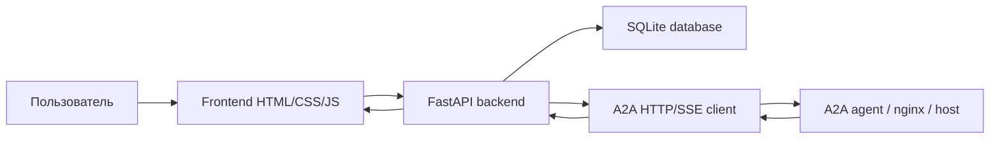
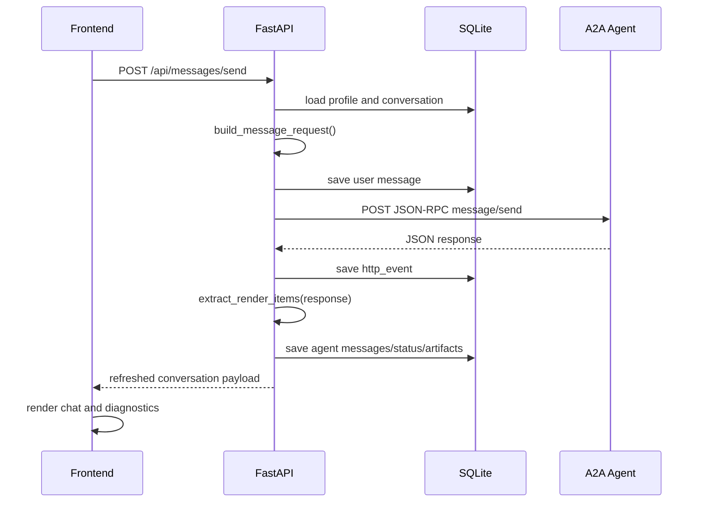
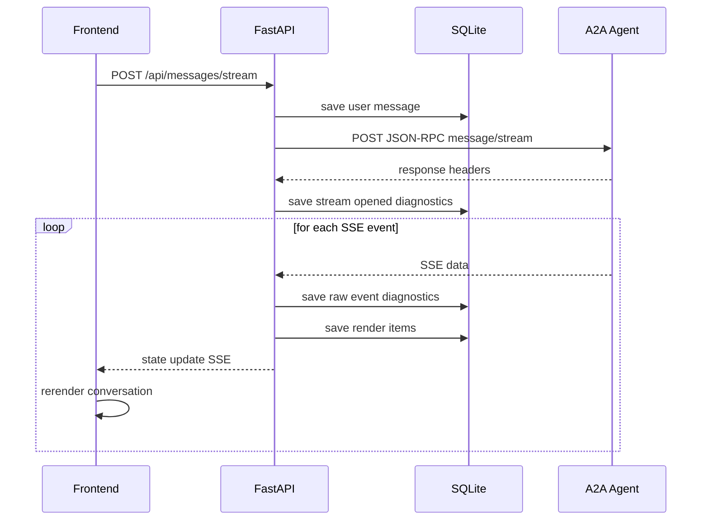

# Документация проекта A2A Tester

Этот документ описывает, как устроен A2A Tester: из каких частей состоит приложение, как проходит запрос к агенту, где хранятся данные, как работают сертификаты, headers, metadata, чаты, диагностика и отображение A2A-событий.

## Назначение

A2A Tester - локальное desktop/web-приложение для ручного тестирования A2A-агентов.

Основные задачи:

- создать подключение к A2A-host;
- настроить endpoint, headers, TLS/сертификаты, metadata и timeout;
- создать отдельный чат с собственным `contextId`;
- отправить `message/send` или `message/stream`;
- увидеть сообщения пользователя, сообщения агента, task statuses, artifacts и ошибки в виде обычного чата;
- открыть JSON diagnostics и посмотреть сырой request/response;
- сохранить состояние приложения между перезапусками.

## Технологический стек

- Python - основной язык приложения.
- FastAPI - backend и локальный HTTP API.
- HTML/CSS/JavaScript - frontend без Node/Vite.
- pywebview - desktop-окно поверх локального web-интерфейса.
- SQLite - локальная база для профилей, чатов, сообщений и диагностики.
- httpx - HTTP/SSE-клиент для запросов к A2A-агентам.
- PyInstaller - сборка в один исполняемый файл.

## Структура проекта

```text
a2a_tester/
  main.py              # точка входа CLI/desktop/server
  server.py            # FastAPI backend, REST API, desktop launcher
  frontend/
    index.html         # DOM-структура интерфейса
    app.css            # темы, layout, chat UI
    app.js             # frontend state, API calls, рендер UI
  a2a/
    client.py          # HTTP/SSE transport, TLS, headers
    jsonrpc.py         # сборка JSON-RPC payload
    render.py          # превращение A2A payload в элементы чата
    sse.py             # парсер Server-Sent Events
  storage/
    database.py        # SQLite schema и методы доступа
    paths.py           # выбор папки данных
scripts/
  build.py             # PyInstaller-сборка
docs/
  PROJECT_DOCUMENTATION.md
```

## Общая архитектура



Приложение запускает локальный FastAPI-сервер. Frontend открывается либо в `pywebview` desktop-окне, либо в браузере. Все действия пользователя идут через локальные `/api/*` endpoints. Backend сохраняет настройки и историю в SQLite, а запросы к агенту выполняет через `httpx`.

## Режимы запуска

### Desktop-режим

```bash
python -m a2a_tester.main
```

Backend стартует на локальном порту, после чего открывается desktop-окно через `pywebview`.
На Linux приложение сначала проверяет наличие GUI-backend: GTK через `gi` или Qt через `qtpy` + `PyQt6`/`PySide6`. Если backend не найден, `pywebview` не стартует, чтобы не печатать traceback про GTK/QT, а UI открывается в обычном браузере.

### Portable-режим

```bash
python -m a2a_tester.main --portable
```

Данные сохраняются рядом с приложением:

```text
data/
  a2a_tester.sqlite3
  certificates/
```

### Web-only режим

```bash
python -m a2a_tester.main --host 127.0.0.1 --port 7860 --no-browser
```

Приложение не открывает desktop-окно, а просто поднимает локальный web-сервер.

### Smoke-test

```bash
python -m a2a_tester.main --portable --smoke-test
```

Проверяет, что база создаётся, миграции проходят, frontend найден, FastAPI-приложение собирается.

## Основные сущности

### Profile

Profile - это подключение к конкретному A2A-host.

В профиле хранятся:

- имя подключения;
- endpoint;
- headers;
- metadata JSON;
- TLS verify flag;
- путь к CA bundle;
- путь к client certificate;
- путь к client key;
- timeout;
- версия протокола.

Сертификаты относятся именно к профилю, а не к чату. Это важно: один host может иметь много чатов, но TLS-настройки у них общие.

### Conversation

Conversation - это чат внутри выбранного профиля.

В чате хранятся:

- `profile_id`;
- `title`;
- `context_id`;
- timestamps;
- список сообщений;
- HTTP diagnostics;
- artifacts.

Каждый новый чат создаёт новый `contextId`. Этот `contextId` передаётся в `message.contextId` при отправке сообщений.

### Message

Message - отображаемая единица в чате.

Возможные типы:

- `message` - обычное сообщение пользователя или агента;
- `status` - состояние task;
- `artifact` - artifact от агента;
- `error` - ошибка transport/backend/agent;
- `debug` - fallback, если payload не удалось распарсить в известные элементы.

### Http Event

Http event - запись в diagnostics.

Там хранится:

- метод (`message/send`, `message/stream`, `tasks/get`, `tasks/cancel`, `agent-card`);
- JSON-RPC id;
- request JSON;
- response JSON;
- response headers;
- status code;
- latency;
- error text.

Diagnostics нужны для сверки с Insomnia/Postman и отладки nginx/agent-side ошибок.

## Схема базы данных

SQLite создаётся в `a2a_tester/storage/database.py`.

### `app_settings`

Хранит настройки приложения:

| Поле | Назначение |
| --- | --- |
| `key` | имя настройки |
| `value` | значение |

Сейчас используется для выбранной темы UI.

### `profiles`

Хранит подключения к хостам.

| Поле | Назначение |
| --- | --- |
| `id` | id профиля |
| `name` | имя подключения |
| `endpoint` | A2A endpoint |
| `headers_json` | headers в JSON |
| `metadata_json` | metadata, добавляемая в JSON-RPC params |
| `tls_verify` | проверять TLS-сертификат сервера |
| `ca_bundle_path` | путь к CA bundle |
| `client_cert_path` | путь к client certificate |
| `client_key_path` | путь к client key |
| `timeout_seconds` | timeout запросов |
| `protocol_version` | выбранная версия протокола |
| `created_at` | дата создания |
| `updated_at` | дата обновления |

### `conversations`

Хранит чаты.

| Поле | Назначение |
| --- | --- |
| `id` | id чата |
| `profile_id` | профиль подключения |
| `title` | название чата |
| `context_id` | A2A contextId |
| `archived` | признак архивации |
| `created_at` | дата создания |
| `updated_at` | дата обновления |

### `messages`

Хранит элементы чата.

| Поле | Назначение |
| --- | --- |
| `id` | id сообщения |
| `conversation_id` | чат |
| `task_id` | task id, если известен |
| `role` | `user`, `agent`, `system` |
| `kind` | `message`, `status`, `artifact`, `error`, `debug` |
| `text` | отображаемый текст |
| `raw_json` | исходный JSON элемента |
| `created_at` | дата сохранения |

Порядок отображения строится по `id ASC`, то есть по фактическому порядку вставки атомарных сообщений в базу. `http_events` не используется как источник чата; это только diagnostics.

### `artifacts`

Хранит отдельную копию artifacts.

| Поле | Назначение |
| --- | --- |
| `id` | id artifact |
| `conversation_id` | чат |
| `task_id` | task id |
| `name` | имя artifact |
| `mime_type` | MIME type |
| `content_text` | извлечённый текст |
| `content_json` | artifact JSON |
| `file_path` | путь к сохранённому файлу, если появится файловое хранение |
| `raw_json` | исходный JSON |
| `created_at` | дата сохранения |

Сейчас artifacts также попадают в `messages`, чтобы пользователь видел их в чате.

### `http_events`

Хранит diagnostics.

| Поле | Назначение |
| --- | --- |
| `id` | id события |
| `conversation_id` | чат |
| `profile_id` | профиль |
| `jsonrpc_id` | id JSON-RPC запроса |
| `method` | A2A/служебный метод |
| `request_json` | отправленный JSON |
| `response_json` | полученный JSON |
| `response_headers_json` | response headers |
| `status_code` | HTTP status |
| `latency_ms` | длительность запроса |
| `error` | ошибка |
| `created_at` | дата сохранения |

## Жизненный цикл запроса `message/send`



### Как собирается JSON-RPC

Файл: `a2a_tester/a2a/jsonrpc.py`.

`build_message_request()` создаёт payload:

```json
{
  "jsonrpc": "2.0",
  "id": "...",
  "method": "message/send",
  "params": {
    "message": {
      "kind": "message",
      "role": "user",
      "messageId": "...",
      "parts": [
        {
          "kind": "text",
          "text": "..."
        }
      ],
      "contextId": "...",
      "taskId": "..."
    },
    "metadata": {}
  }
}
```

`taskId` добавляется только если текущая task находится в `input-required`.

## Жизненный цикл `message/stream`

`message/stream` работает через SSE.



Backend получает SSE от агента, сохраняет каждое событие в diagnostics и после каждого события отправляет frontend-у обновлённое состояние чата.

## TLS и сертификаты

Файл transport: `a2a_tester/a2a/client.py`.

TLS-настройки берутся из profile:

- `tls_verify`;
- `ca_bundle_path`;
- `client_cert_path`;
- `client_key_path`.

В UI есть два режима выбора файлов:

- `Pick Path` - desktop-режим через `pywebview`, в profile сохраняется настоящий абсолютный путь к файлу;
- `Import Copy` - браузерный file picker, файл копируется в `data/certificates/profile_{profile_id}/`, а в profile сохраняется путь к копии.

Ограничение браузера: обычный `<input type="file">` не отдаёт frontend настоящие абсолютные пути локальной файловой системы. Поэтому в браузере невозможно корректно сохранить исходный путь без desktop API; для этого и нужен `Pick Path`.

### CA bundle

CA bundle нужен, если сервер агента использует сертификат, который не доверен системным trust store.

Если `tls_verify = true` и указан `ca_bundle_path`, backend создаёт:

```python
ssl.create_default_context(cafile=ca_bundle_path)
```

### Client certificate и client key

Client certificate/key нужны для mTLS, когда nginx или сервер агента требует клиентский сертификат.

Если указан client certificate, backend загружает его в TLS context:

```python
context.load_cert_chain(certfile=client_cert_path, keyfile=client_key_path)
```

Если key не нужен или certificate уже содержит private key, `client_key_path` может быть пустым.

### Валидация файлов

Backend проверяет загружаемые файлы:

- CA bundle и client certificate должны содержать `-----BEGIN CERTIFICATE-----`;
- client key должен содержать `PRIVATE KEY-----`;
- key без client certificate не разрешён;
- пустые файлы не разрешены;
- очень большие файлы не разрешены.

Это защищает от ситуации, когда пользователь случайно выбрал изображение или другой не-PEM файл.

### Важное про HTTP endpoint

TLS применяется только для `https://` endpoint. Если endpoint начинается с `http://`, сертификаты не участвуют в запросе, потому что TLS-соединения нет.

## Headers

Headers редактируются в UI и хранятся в `profiles.headers_json`.

Внутренний формат:

```json
{
  "Authorization": {
    "enabled": true,
    "value": "Bearer token",
    "secret": true
  }
}
```

Перед запросом backend берёт только enabled headers:

```python
active_headers(...)
```

Transport автоматически добавляет:

- `Content-Type: application/json`;
- `Accept: application/json` для обычного запроса;
- `Accept: text/event-stream` для stream-запроса.

Если пользователь явно указал эти headers, его значение сохраняется.

## Metadata

Metadata вводится как JSON object и хранится в `profiles.metadata_json`.

При отправке сообщения metadata добавляется в `params.metadata`:

```json
{
  "params": {
    "message": {},
    "metadata": {
      "traceId": "example"
    }
  }
}
```

Если metadata невалидна или не является JSON object, backend возвращает ошибку `400`.

## Context ID и новые чаты

Новый чат создаётся через:

```text
POST /api/conversations
```

Backend создаёт UUID:

```python
new_context_id()
```

Этот `contextId` хранится в `conversations.context_id` и передаётся в каждом новом `message`.

Если агент возвращает другой `contextId` в response, backend обновляет chat context через `update_conversation_context()`.

## Input-required

Input-required определяется по последнему task status.

Backend ищет последний `task_id` и последний state:

- `latest_task_id()`;
- `latest_task_state()`;
- `is_input_required()`.

Если state равен `input-required` или `input_required`, следующий пользовательский message отправляется с тем же `taskId`.

Это нужно, чтобы продолжить существующую task, а не начать новую.

## Отображение сообщений и порядок событий

Файл: `a2a_tester/a2a/render.py`.

Backend превращает ответ агента в список `RenderItem`.

Поддерживаются:

- task status;
- status message;
- agent/user messages;
- artifacts;
- errors;
- fallback debug payload.

### Правило порядка

Порядок должен соответствовать тому, как данные пришли от агента.

Для SSE порядок естественный: события обрабатываются по мере прихода.

Каждый SSE event раскладывается на отдельные `messages` rows сразу во время получения stream. Frontend получает эти сохранённые атомарные строки, а diagnostics остаётся отдельным raw-log.

Для обычного `message/send`, когда агент возвращает финальный Task snapshot, snapshot раскладывается в стабильном порядке:

```text
history/messages -> artifacts -> status
```

Это не stream-order, а нормализация snapshot-структуры: Task snapshot сам по себе не является журналом событий, поэтому приложение сохраняет его как отдельные chat-сообщения по смысловым секциям.

### Защита от дублей

Пользовательское сообщение сохраняется в базу до отправки запроса. Если агент возвращает это же user message внутри `history`, backend не добавляет его второй раз в чат.

Также backend проверяет, не сохранён ли уже такой же render item по `role`, `kind`, `task_id` и `raw_json`.

## Diagnostics

Diagnostics отображается в нижнем раскрывающемся блоке `JSON diagnostics`.

Frontend показывает массив событий:

```json
[
  {
    "createdAt": "...",
    "method": "message/send",
    "jsonrpcId": "...",
    "statusCode": 200,
    "latencyMs": 123.4,
    "request": {},
    "response": {},
    "responseHeaders": {},
    "error": ""
  }
]
```

Чувствительные response headers маскируются:

- `Authorization`;
- `Cookie`;
- `X-API-Key`;
- `API-Key`;
- `Proxy-Authorization`.

Request headers сейчас не пишутся в diagnostics как отдельное поле. Они хранятся в profile.

## Backend API

### App state

```text
GET /api/state
```

Возвращает:

- список профилей;
- выбранный профиль;
- список чатов;
- выбранный чат;
- тему UI;
- список палитр.

### Theme

```text
POST /api/settings/theme
```

Сохраняет выбранную палитру.

### Profiles

```text
POST /api/profiles
GET /api/profiles/{profile_id}
PUT /api/profiles/{profile_id}
```

Создание, получение и обновление подключения.

### Certificate upload

```text
POST /api/profiles/{profile_id}/certificates/{field_name}
```

`field_name` может быть:

- `ca_bundle_path`;
- `client_cert_path`;
- `client_key_path`.

Этот endpoint относится к режиму `Import Copy`. Файл копируется в:

```text
data/certificates/profile_{profile_id}/
```

После загрузки путь к копии сохраняется в profile. В режиме `Pick Path` upload endpoint не вызывается: desktop API возвращает абсолютный путь, frontend записывает его в поле profile, а затем обычное сохранение профиля отправляет путь на backend.

### Conversations

```text
POST /api/conversations
GET /api/conversations/{conversation_id}
```

Создаёт новый чат или загружает существующий.

### Messages

```text
POST /api/messages/send
POST /api/messages/stream
```

Обычный запрос и stream-запрос к агенту.

### Task tools

```text
POST /api/tasks/get
POST /api/tasks/cancel
```

Отправляют `tasks/get` или `tasks/cancel`.

Payload содержит:

```json
{
  "profileId": 1,
  "conversationId": 1,
  "taskId": "..."
}
```

### Agent Card

```text
POST /api/agent-card
```

Загружает:

```text
/.well-known/agent-card.json
```

от host-а, полученного из endpoint.

## Frontend state

Файл: `a2a_tester/frontend/app.js`.

Основной объект состояния:

```javascript
const state = {
  profiles: [],
  profile: null,
  conversations: [],
  conversation: null,
  selectedProfileId: null,
  selectedConversationId: null,
  selectedHeaderName: null,
  theme: "studio",
  palettes: [],
  busy: false,
};
```

Frontend не хранит состояние сам по себе надолго. После действий он получает обновлённый payload от backend и перерисовывает UI.

Главные render-функции:

- `renderProfileSelect()`;
- `renderProfileForm()`;
- `renderHeaderCards()`;
- `renderConversations()`;
- `renderConversation()`;
- `renderMessage()`.

## Сборка приложения

Сборка запускается так:

```bash
python scripts/build.py
```

Скрипт вызывает PyInstaller и добавляет frontend как bundled data:

```text
a2a_tester/frontend
```

Результат:

```text
dist/A2ATester
```

Для portable-запуска:

```bash
./dist/A2ATester --portable
```

## Отладка проблем

### Сертификат не прокидывается

Проверить:

- endpoint начинается с `https://`;
- загружен `client_cert_path`, если сервер требует mTLS;
- загружен `client_key_path`, если private key не внутри client certificate;
- CA bundle не является client certificate;
- файл не является изображением или DER без PEM;
- nginx действительно доверяет CA, которым подписан client certificate.

### В базе лежит неправильный файл сертификата

Проверить profile:

```bash
sqlite3 data/a2a_tester.sqlite3 \
  "select id, ca_bundle_path, client_cert_path, client_key_path from profiles;"
```

Проверить файл:

```bash
openssl x509 -in path/to/cert.pem -noout -subject -issuer -dates
```

### Порядок сообщений кажется неправильным

Проверить diagnostics:

- для `message/stream` смотреть порядок SSE events;
- для `message/send` смотреть порядок ключей и вложенных элементов в response JSON;
- помнить, что приложение не должно сортировать события по смыслу, только сохранять порядок получения/разбора.

### `input-required` не продолжает task

Проверить:

- есть ли последний status со state `input-required` или `input_required`;
- есть ли `taskId` в последнем task/status/artifact payload;
- отправляется ли следующий user message в том же conversation.

### Нет места на диске

Можно удалить игнорируемые артефакты:

```bash
rm -rf build dist .pyinstaller .venv
```

После удаления `.venv` восстановить окружение:

```bash
python3 -m venv .venv
. .venv/bin/activate
python -m pip install -r requirements.txt
```

## Что важно помнить при доработке

- Profile отвечает за соединение и TLS.
- Conversation отвечает за `contextId` и историю диалога.
- Messages отвечают за то, что видно пользователю в чате.
- Artifacts дополнительно сохраняются отдельно, но также отображаются как chat messages.
- Diagnostics должны оставаться максимально близкими к сырому request/response.
- Порядок A2A-событий нельзя переупорядочивать “по красоте”; он должен отражать то, что прислал агент.
